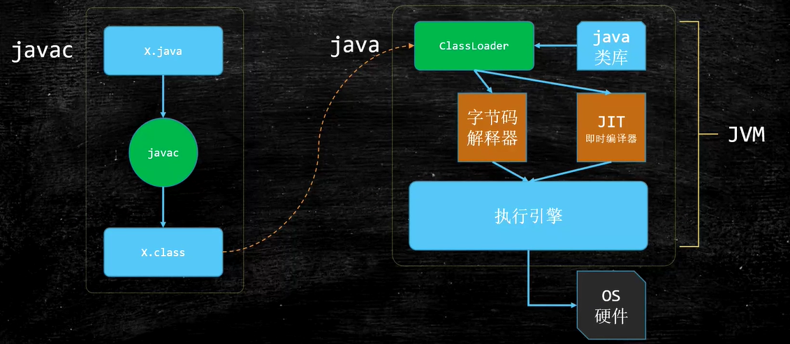
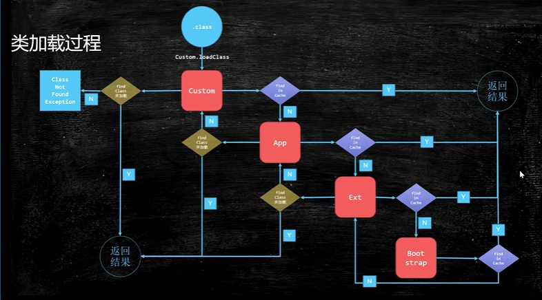
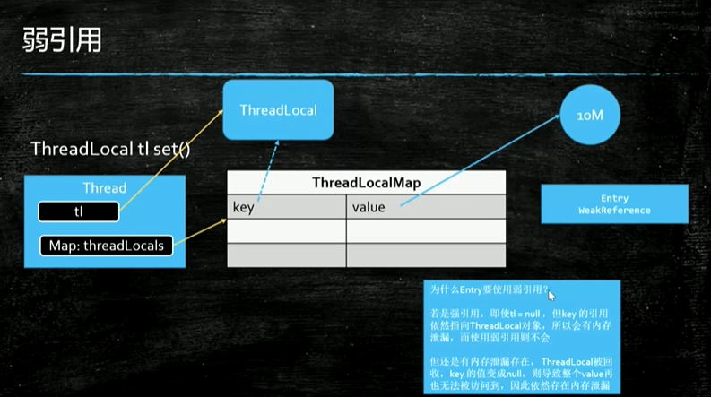
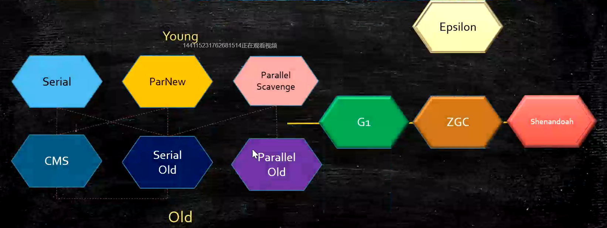

# JVM

跨语言的平台：屏蔽了OS的实现

任何语言，只要可以编译成class文件（符合规范），就可以在jvm中运行。

JIT：常用代码

## 类加载过程

主要问题 ：为了安全，防止基本类被覆盖

次要问题 ：资源浪费

## 内存空间

栈内存

> 每一个线程都有自己的栈空间

1. 栈帧（一个方法对应一个栈帧）
   存储数据（局部变量表）、操作数栈、动态链接（指向class的常量池）、返回值地址

native栈内存

> 不受JVM管理

PC内存

> 每一个线程有自己的计数器

方法区

> 所有的线程共享
>
> 每一个class的结构

1. Perm Space(<1.8)
   字符串常量位于Perm Space , FGC 不会清理
2. Meta Space(>=1.8)
   字符串常量位于堆，会触发FGC清理

常量池

> class的常量

堆

> 所有线程共享

直接内存

> 堆外内存

## 引用的类型

1. 强
   存在对象引用。x=null：打断引用

2. 软 SoftReference
   系统内存不够的情况下，会被回收。
   在系统将要发生内存溢出异常之前，将会把这些对象列进回收范围进行第二次回收。

3. 弱 WeakReference

   只要遇到GC，就会被回收。
   如果有另外一个强引用指向他的时候，如果强引用消失，就不用管了。
   一般用在容器中
   WeakHashMap
   AQS的unlock

4. 虚 堆外内存
   回收：C/C++ delete free等命令java unsafe

## GC

动态年龄的触发界定：size>50%时，年龄大的升级到老年代

在年轻代向老年代升级的过程中，如果老年代空间不足，会触发FullGC

### 常见的垃圾回收器

1. Serial 年轻代 串行 Coping
2. Serial Old 老年代 串行 整理压缩
3. PS 年轻代 并行 Coping<吞吐量优先>
4. PO老年代 并行 标记整理
5. PN 年轻代 并行 Coping 做了一些增强，以便可以和CMS配合使用<响应时间优先>
6. CMS 
   1. 碎片化问题（请SO）
   2. 浮动垃圾问题 - 降低CMS触发阈值

## STW Stop-The-World

***** System.GC()是fullGC

