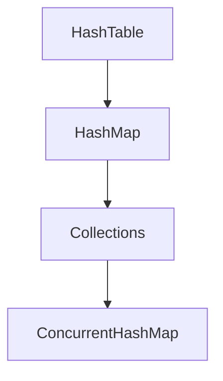

# 容器


1. 容器牵扯到数据结构

2. 容器牵扯到算法

3. 容器的组织结构

4. 容器牵扯到高并发


## 按Java接口分类

### 1. Collection

一个一个存入容器

#### List

##### CopyOnWriteList

写时复制

##### Vecror - Stack

##### ArrayList

##### LinkedList

#### Set

##### HashSet - LinkedHashSet

##### SortedSet - TreeSet

##### EnumSet

##### CopyOnWriteArraySet

##### ConcurrentSkipSet


#### Queue
```
offer -> 添加（返回值表示是否成功）（可以指定时间）
peek -> 取（不会remove掉）
poll -> 取（会remove掉）（可以指定时间）

使用链表实现、没有长度限制。
```

##### Deque 双端队列

可以从双端存\读

###### ArrayDeque

###### BlockingDeque - LinkedBlockingDeque


##### BlockingQueue

阻塞队列
```
put ->  添加（阻塞的）
take -> 取  (阻塞的)
```

###### ArrayBlockingQueue (有界的)

###### PriorityBlockingQueue

###### LinkedBlockingQueue (无界的)

###### TransferQueue - LinkedTransferQueue (各种的组合)

可以用add、put、transfer

transfer方法，不同于add/put：会阻塞。take后会解除阻塞

###### SynchronousQueue (线程之间传递任务)

容量为0

不能add，只能put

##### PriorityQueue 优先级队列(排序)

数模型，在add的时候排序

##### ConcurrentLinkedQueue（多线程的）


##### DelayQueue （时间权重队列）（属于BlockingQueue）

包含的对象需要实现Delayed接口，重写getDelay方法

Delayed接口实现了Comparable接口，需要重写compareTo方法

用途：按时间进行任务调度

### 2. Map

一对一对存入容器

<font color="orange">特殊的Collection，把一对视为一个对象</font>

#### HashMap - LinkedHashMap

linked提高迭代效率（添加链表）

#### TreeMap

红黑树

#### WeakHashMap

#### IdentityHashMap

#### Concurrent....

CAS实现原子性

##### ConcurrentHashMap

读取效率非常高

##### ConcurrentSkipListMap(跳表)

排序


### 3.Collections

容器的工具类


## 物理结构

1. 连续存储的数组

2. 非连续存储的链表

## 其它

Vector和HashTable自带锁，基本不用。



1：Vector Hashtable ：早期使用synchronized实现 
2：ArrayList HashSet ：未考虑多线程安全（未实现同步）
3：HashSet vs Hashtable StringBuilder vs StringBuffer
4：Collections.synchronized***工厂方法使用的也是synchronized